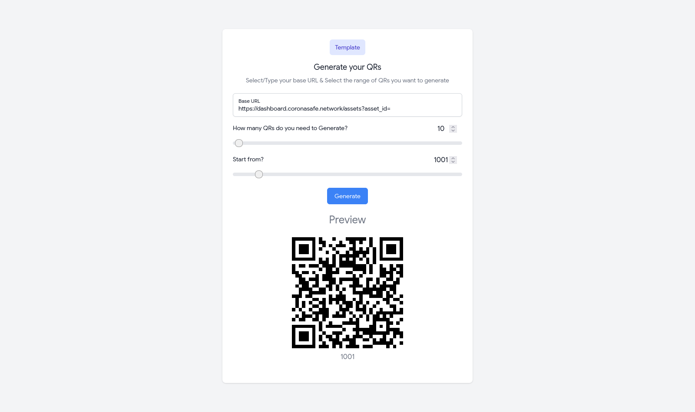

<a href="https://coronasafe.network/">
  

    <picture>
      <source media="(prefers-color-scheme: dark)" srcset="https://cdn.coronasafe.network/light-logo.svg">
      
    </picture>
  

</a>

<b>Our goal is to continuously improve the quality and accessibility of public healthcare services using digital tools.</b>
 

# Asset QR Generator

This is a simple tool to generate bulk QR codes for assets to register assets in [CARE](https://coronasafe.network/).

## Usage

Open the [asset QR generator](https://asset-qr-generator.coronasafe.in/) and enter base url, starting index and number of assets to generate QR codes for.

## Development

1. Clone the repository
2. Install dependencies using `yarn install`
3. Run the development server using `yarn dev`
4. Open [http://localhost:3000](http://localhost:3000) to view it in the browser.

To generate optimized production build, run `yarn build`.

